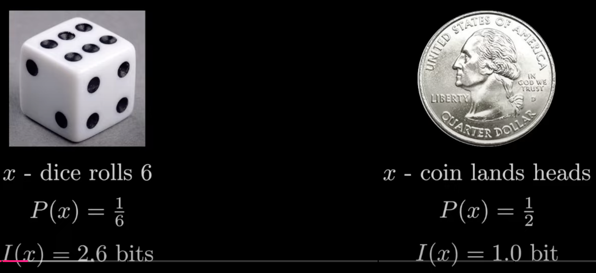

# Reference

1. C. E. Shannon, "A mathematical theory of communication," in The Bell System Technical Journal, vol. 27, no. 3, pp. 379-423, July 1948, doi: 10.1002/j.1538-7305.1948.tb01338.x.
2. J. Duda, K. Tahboub, N. J. Gadgil and E. J. Delp, "The use of asymmetric numeral systems as an accurate replacement for Huffman coding," 2015 Picture Coding Symposium (PCS), Cairns, QLD, Australia, 2015, pp. 65-69, doi: 10.1109/PCS.2015.7170048. keywords: {Decoding;Channel coding;Probability distribution;Entropy;Standards;Huffman coding;asymmetric numeral systems;entropy coding;data compression;Huffman coding;arithmetic coding},
3. https://en.wikipedia.org/wiki/Asymmetric_numeral_systems

# Introdution

- a family of entropy encoding methods
  - Huffman coding
  - Arithmetic coding
  - ANS: ANS combines the compression ratio of [arithmetic coding](https://en.wikipedia.org/wiki/Arithmetic_coding) (which uses a nearly accurate [probability distribution](https://en.wikipedia.org/wiki/Probability_distribution)), with a processing cost similar to that of [Huffman coding](https://en.wikipedia.org/wiki/Huffman_coding). ([Wiki](https://en.wikipedia.org/wiki/Asymmetric_numeral_systems))
- introduced by [Jarosław (Jarek) Duda](https://en.wikipedia.org/wiki/Jarosław_Duda_(computer_scientist))[[3\]](https://en.wikipedia.org/wiki/Asymmetric_numeral_systems#cite_note-3) from [Jagiellonian University](https://en.wikipedia.org/wiki/Jagiellonian_University), 
- Example: 

# Entropy coding

- Source: [Reducible](https://www.youtube.com/watch?v=B3y0RsVCyrw) 

- 3 key problems

  - single symbol --> unique binary code

  - source message = received message

  - unique decodability

- self information function (bits)
  $$
  I(s) = log_2(\frac{1}{P(x)}) = -log_2P(x)
  $$

  - with oberserving event $x$ and it's probability $P(x)$ we can know how many information it carries
  - d
  - 

- give more probable symbols less bits

- Information <u>entropy</u> $H(X)$  of a distribution (Shannon Entropy 1948)
  $$
  H(X) = \sum_{i=1}^n P(x_i)\cdot I(x_i)= \sum P(x) \cdot log_2 (\frac{1}{P(x)}) = - \sum P(x) \cdot log_2 P(x)
  $$

- Shannon's Source Coding Theorem
  $$
  N \cdot H(X)
  $$
  is an achievable lower bound

# Huffman Coding

# Arithmetic Coding

- represents an entire message as a single number, typically a fraction between 0 and 1, 
- lossless data compression
- Unlike Huffman coding, which assigns fixed-length or variable-length binary codes to symbols, <u>arithmetic coding encodes the entire message into a single continuous range</u>. This method achieves compression rates close to the theoretical entropy limit.
- add the information in the most significant position
- 

# Asymmetric Numeral System

> Presentation:
>
> 1. consider the binary system first, which is uniformly distributed
> 2. then asymmetrical numeral system

## motivation

- ANS combines the compression ratio of [arithmetic coding](https://en.wikipedia.org/wiki/Arithmetic_coding) (which uses a nearly accurate [probability distribution](https://en.wikipedia.org/wiki/Probability_distribution)), with a processing cost similar to that of [Huffman coding](https://en.wikipedia.org/wiki/Huffman_coding). ^3^ 

## example1: {2,0,2,5,1,8}

- $\mathcal{A} = \{0,1,2,...,9\}$ 
  - $s_0=s_1=...=s_9 = 1/10$ 
- $S_{in}=\{2,0,2,5,1,8\}$ 
- we want to encode this sequence of digits, what is the simplest way? --> $X=202518$ , represented with a single integer state
- bits of representation of $X=202518$ is $log_2202518$ 
- Encoding $C(x)$ 

$$
C(s_i, x_{i+1})= x_i \cdot 10 + s_i
$$

- Decoding

## example2: different Pr

- $Pr(0)=1/4, Pr(1)=3/4$ 
- 

## basic/general idea

- asymmetric behavior <--> symmetric behavior
  - (non-) uniform distribution
- ANS
  - The basic concept of asymmetric numeral systems (ANS) is to change this symmetric behavior so that the information added to $x(lg(x)$ bits) by coding a new symbol depends on the probability distribution of the symbols, that is not necessarily a uniform distribution. ^2^
  - the information contents of $x$ should be $lg(x) \rightarrow lg(x)+lg(1/p)=lg(x/p)$ 
- add the information in the least significant position
- <u>symbol spread function</u> for a standard base-b numeral system:
  $$
  \bar{s}(x) = mod(x,b)
  $$

  - what is symbol spread function? the function that determines the split of $\N$ into subsets corresponding to different symbols
  - in binary system: $\bar{s}(x)=mod(x,2)$ . It split the natural numbers into subsets of even/odd numbers
- Encoding function:
  $$
  x'=C(s,x)
  $$

  - $x'$ is $x$-th apprearance of symbol $s$ 

## binary system (uniform binary variant=uABS)

- symbol spread function: $b=2$ --> $\bar{s}(x)=mod(x,2)$ , we split natural numbers into even/odd numbers
- x-th appearance of symbol s: $x' = C(s,x) = 2x+s$ 
- this is symmetric, because the probability of symbols (0, 1) are same, which means it is uniformly distributed 

## rANS (Range Variant)

similar to the arithmetic encoding

- Encoding

  - in paper
    $$
    x'=C(s,x)=\lfloor x/f_s \rfloor <<n + mod(x,f_s)+c_s
    $$
    

    - $b'=2^n$ standard numeral system
    - $f_s$: 
    - $\sum_s f_s = 2^n$ 
    - $c_s := f_0+...+f_{s-1}$ 

  

  - [post of kedar](https://kedartatwawadi.github.io/post--ANS/) 
    $$
    x_t = \lfloor x_{t-1}/F_{s_t} \rfloor \cdot M + mod(x_{t-1}, F_{s_t}) + C_{s_t}
    $$

    - $F_{s_t}$: absolute frequency of symbol $s_t$ 
    - $M=\sum^k_{i=1}F_i$ 
    - $C_{s_t}=\sum_{j=1}^{i-1} F_{a_j}$ --> cumulative distribution of the symbols

- Decoding

  - 

- streaming for avoiding of very large natural number 

  - enforce $x$ to remain in some fixed range $I$ by transferring the least significant bits to the stream

- 

### example

### performance

## streaming rANS

## tANS

