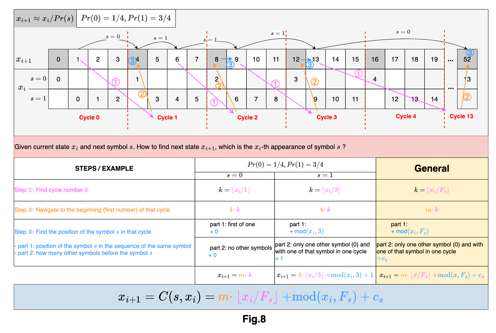
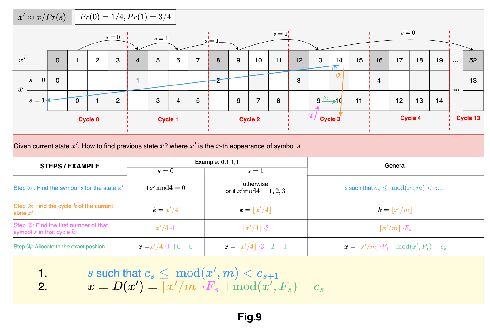

# Asymmetric Numeral System

This is a repository for data compression lecutre which I had in my 5. semester in Uni Leipzig. The topic I got was ANS (Asymmetric Numeral System), so this is main content you can find here. My task was to understand the paper from Jarek Duda and introduce to other people, but I did much more than that, which was not the main goal of the lecture, so I didn't got good enough note as I expected. \\
I tried to understand how ans algorithm works during encoding and decoding, mainly for range-ANS. There is also content about streaming ANS, but this was also introduced by lecture from standford. \\
With the following two figures you may understand better and easier how it ans works. \\
The visulization dash app is also available in implementation folder. The lecture from standford about data compression helps a lot. Thank for that. \\

# rANS Encoding

# rANS Decoding
